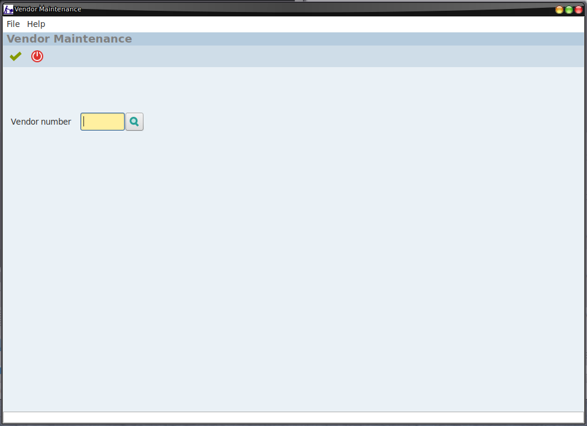
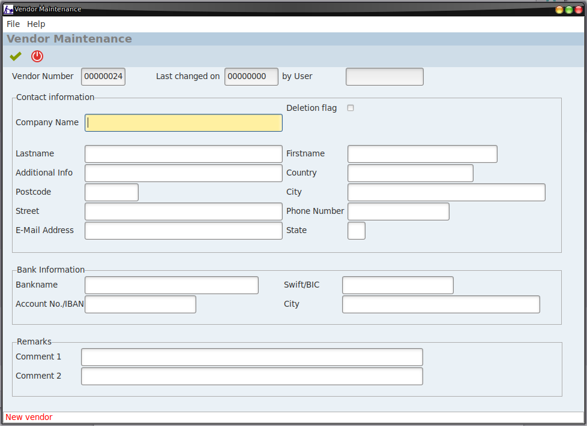
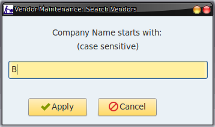
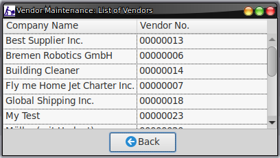
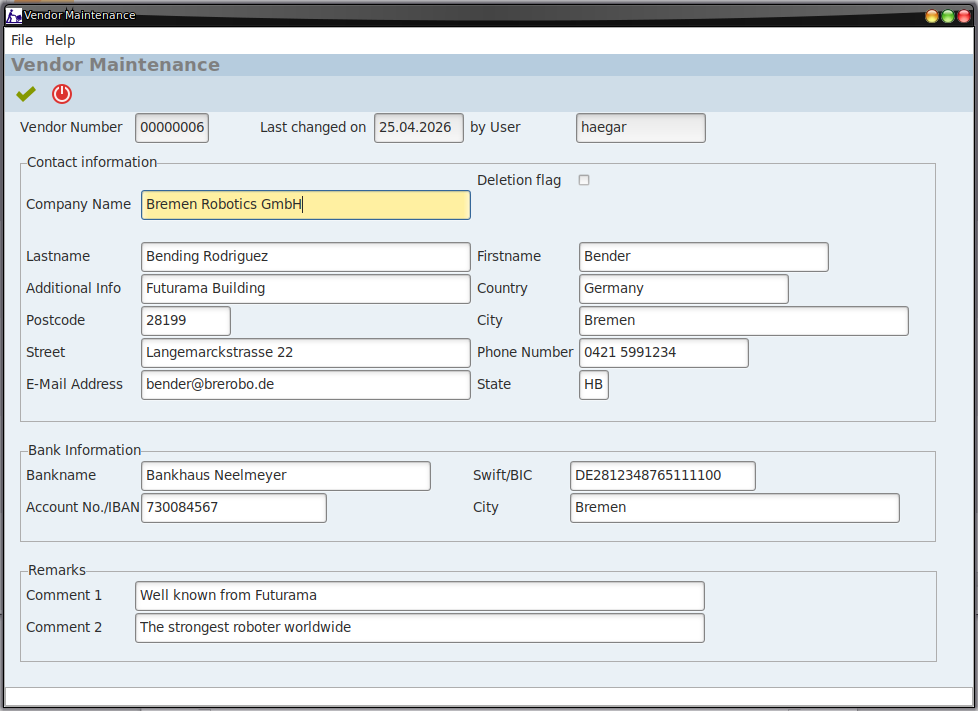
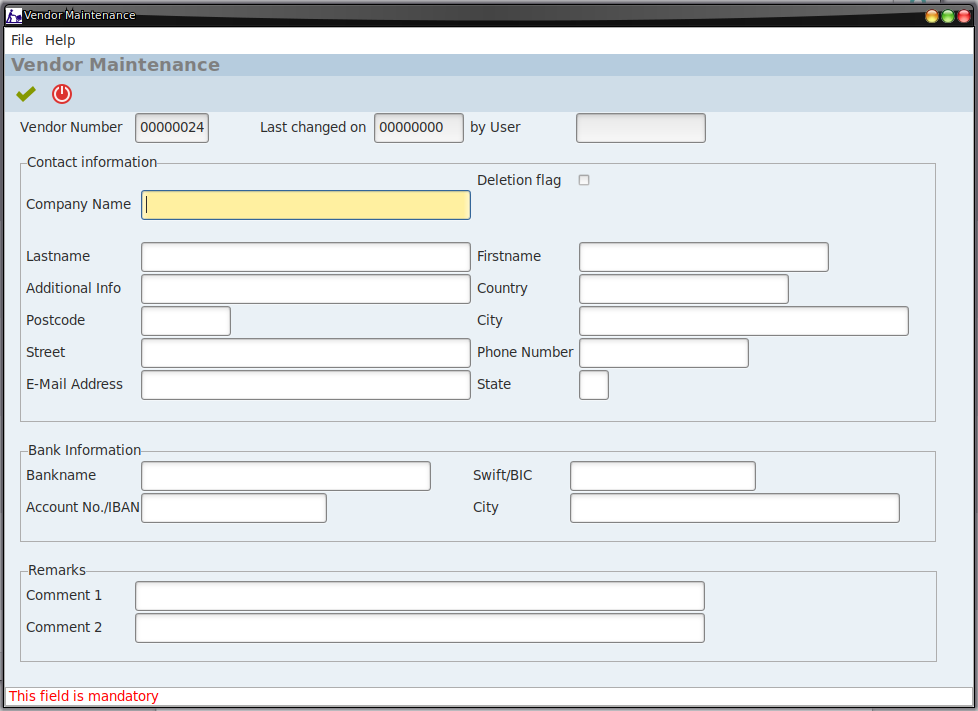
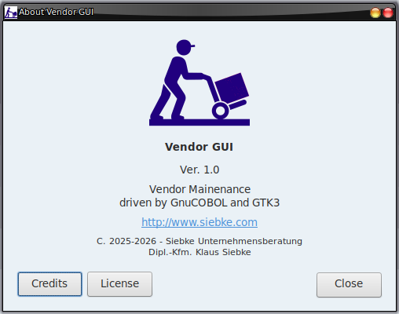
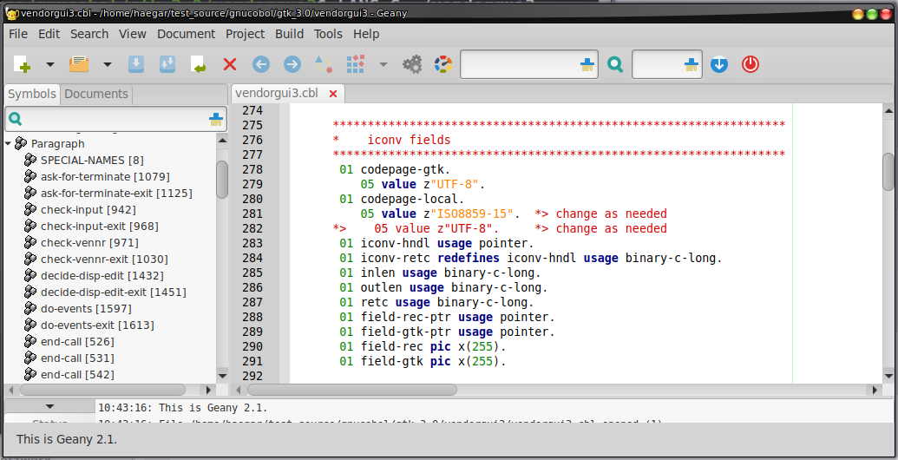

# Vendor GUI 3 (vendorgui3)

This is a proof of concept solution based on GnuCOBOL 3.2 with VBISAM 2.1.1 and GTK3 for a master data maintenance application offering CRUD (create/read/update&delete) functionality and multi-user support.

The program manages a supplier/vendor database. It’s main focus is on simplicity,  following Einstein's maxim: "Everything should be as simple as possible, but not simpler.".

After starting the program this screen is presented:

Now you can either

* Enter an existing vendor number

* Enter a non-existing vendor number

* Leave the field vendor number empty

In the latter two cases the system will create a new vendor record. If you leave the field empty, the program will determine the next free vendor number first and then offer the vendor details screen.

On the details screen you can enter these fields:

Alternatively you can use the search button on the first screen to pick up the vendor you like to maintain. In this case we know that the company name starts with “B”:

All vendors starting with “B” and the subsequent ones are listed and we can pick up our vendor by a double-click:

Here we got it:

 

Currently there is only one check implemented: the company name should not be empty (see below)

However, further checks can be added following the same logic.

If another user maintains a vendor record, this message will be shown and the vendor will only be displayed:

This is the about screen:

I highly recommend to built the GnuCOBOL compiler with VBISAM support (./configure --with-vbisam) and use the version 2.1.1 of VBISAM, which ensures full multi-user file handling.

You can get the source of VBISAM 2.1.1 here:

[https://sourceforge.net/p/gnucobol/discussion/cobol/thread/49d76dc54e/1a3c/attachment/vbisam-2.1.1_20240427.tar.gz](https://sourceforge.net/p/gnucobol/discussion/cobol/thread/49d76dc54e/1a3c/attachment/vbisam-2.1.1_20240427.tar.gz)

After compiling VBISAM and GnuCOBOL you can build the program with: 

cobc --static -x `pkg-config --libs gtk+-3.0` vendorgui3.cbl

One hint: 

If you live in a country which uses a language with special characters (like almost all European countries) you should use a single-byte (8-bit) code page for your language. This ensures that the fields in the record are filled in their correct length.

If this does not affect you (e.g. in the U.S.), you can change this line in program:

In this case no code page conversion will take place.

